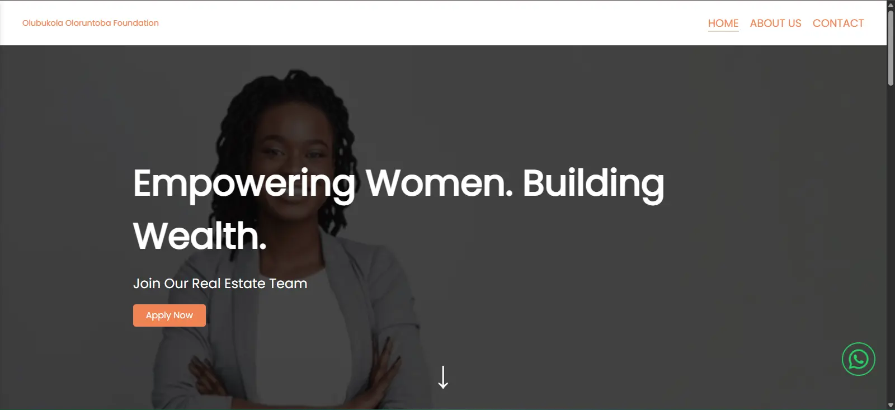

# My Portfolio

A personal portfolio website showcasing my projects and skills.

---

## 🚀 Live Demo

[View Portfolio](https://s4mantha18.github.io/myPortfolio/)

---

## 📸 Preview



---

## ✨ Features

* Responsive design for desktop and mobile
* Project showcase with images and descriptions
* About Me section with skills and background
*  social links

---

## 🛠️ Tech Stack

* **HTML**
* **CSS3**
* **JavaScript**

---

## 🏗️ Installation & Usage

1. Clone the repo:

   ```bash
   git clone https://github.com/s4mantha18/myPortfolio.git
   ```
2. Open `index.html` in your browser.

---

## 🌍 Deployment

This project can be deployed easily with **GitHub Pages**:

* Go to **Repo Settings > Pages**
* Select `main` branch and root folder
* Save and your site will be live!

---

## 📬 Contact

* GitHub: [@s4mantha18](https://github.com/s4mantha18)
* LinkedIn: \[[Samantha](https://www.linkedin.com/in/samanthaoloruntoba18/)]
* Email: \[[samanthaoloruntoba6@gmail.com](mailto:samanthaoloruntoba6@gmail.com)]

---

> If you like this project, consider giving it a ⭐ on GitHub!
